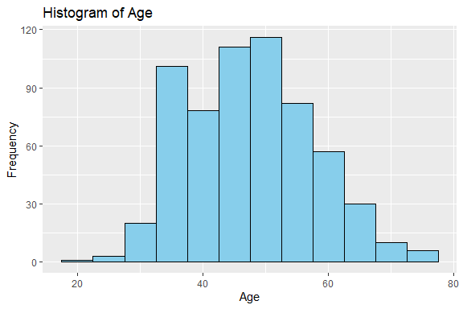
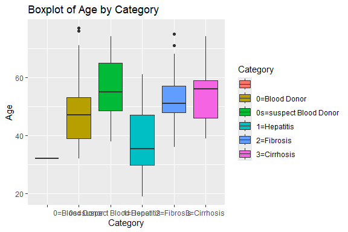
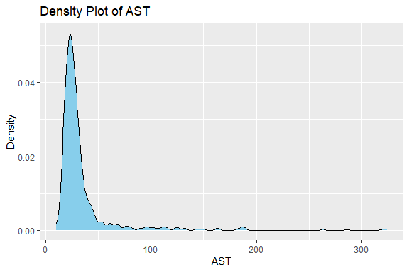
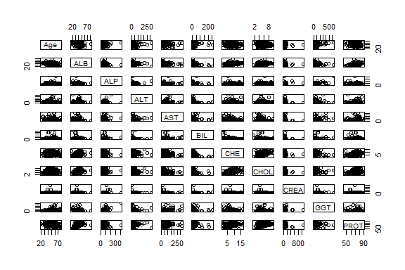
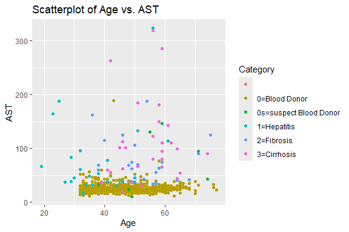
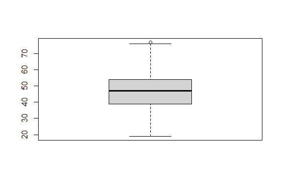
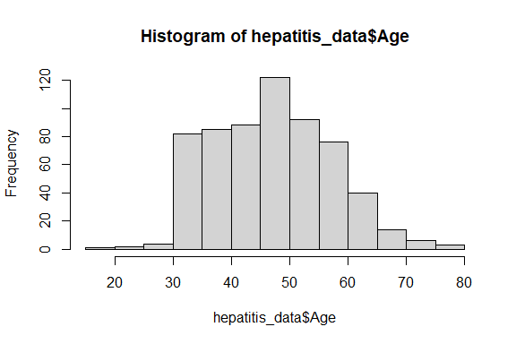

Hepatitis C Prediction
================
Trevor Okinda
2024

- [Student Details](#student-details)
- [Setup Chunk](#setup-chunk)
  - [Source:](#source)
  - [Reference:](#reference)
- [Exploratory Data Analysis](#exploratory-data-analysis)
  - [Load dataset](#load-dataset)
  - [Measures of Frequency](#measures-of-frequency)
  - [Measures of Central Tendency](#measures-of-central-tendency)
  - [Measures of Distribution](#measures-of-distribution)
  - [Measures of Relationship](#measures-of-relationship)
  - [ANOVA](#anova)
  - [Plots](#plots)
- [Preprocessing and Data
  Transformation](#preprocessing-and-data-transformation)
  - [Missing Values](#missing-values)
  - [Dataset Cleaning](#dataset-cleaning)
- [Training Model](#training-model)
  - [Data Splitting](#data-splitting)
  - [Bootstrapping](#bootstrapping)
  - [Model Training](#model-training)
  - [Saving Model](#saving-model)

# Student Details

|                       |                        |
|-----------------------|------------------------|
| **Student ID Number** | 134780                 |
| **Student Name**      | Trevor Okinda          |
| **BBIT 4.2 Group**    | C                      |
| **Project Name**      | Hepatitis C Prediction |

# Setup Chunk

**Note:** the following KnitR options have been set as the global
defaults: <BR>
`knitr::opts_chunk$set(echo = TRUE, warning = FALSE, eval = TRUE, collapse = FALSE, tidy = TRUE)`.

More KnitR options are documented here
<https://bookdown.org/yihui/rmarkdown-cookbook/chunk-options.html> and
here <https://yihui.org/knitr/options/>.

### Source:

The dataset that was used can be downloaded here: *\<<a
href="https://www.kaggle.com/datasets/fedesoriano/hepatitis-c-dataset\"
class="uri">https://www.kaggle.com/datasets/fedesoriano/hepatitis-c-dataset\</a>\>*

### Reference:

*\<Lichtinghagen, R., Klawonn, F., & Hoffmann, G. (2015). Hepatitis C
Prediction Dataset. UCI Machine Learning Repository. Retrieved from
<a href="https://archive.ics.uci.edu/ml/datasets/HCV+data\"
class="uri">https://archive.ics.uci.edu/ml/datasets/HCV+data\</a>\>  
Refer to the APA 7th edition manual for rules on how to cite datasets:
<https://apastyle.apa.org/style-grammar-guidelines/references/examples/data-set-references>*

# Exploratory Data Analysis

## Load dataset

``` r
# Load dataset
hepatitis_data <- read.csv("HepatitisCdata.csv", colClasses = c(
  Category = "factor",
  Age = "numeric",
  Sex = "factor",
  ALB = "numeric",
  ALP = "numeric",
  ALT = "numeric",
  AST = "numeric",
  BIL = "numeric",
  CHE = "numeric",
  CHOL = "numeric",
  CREA = "numeric",
  GGT = "numeric",
  PROT = "numeric"
))

# Display the structure of the dataset
str(hepatitis_data)
```

    ## 'data.frame':    616 obs. of  13 variables:
    ##  $ Category: Factor w/ 6 levels "","0=Blood Donor",..: 2 2 2 2 2 2 2 2 1 2 ...
    ##  $ Age     : num  32 32 32 32 32 32 32 32 32 32 ...
    ##  $ Sex     : Factor w/ 3 levels "","f","m": 3 3 3 3 3 3 3 3 3 3 ...
    ##  $ ALB     : num  38.5 38.5 46.9 43.2 39.2 41.6 46.3 42.2 50.9 42.4 ...
    ##  $ ALP     : num  52.5 70.3 74.7 52 74.1 43.3 41.3 41.9 65.5 86.3 ...
    ##  $ ALT     : num  7.7 18 36.2 30.6 32.6 18.5 17.5 35.8 23.2 20.3 ...
    ##  $ AST     : num  22.1 24.7 52.6 22.6 24.8 19.7 17.8 31.1 21.2 20 ...
    ##  $ BIL     : num  7.5 3.9 6.1 18.9 9.6 12.3 8.5 16.1 6.9 35.2 ...
    ##  $ CHE     : num  6.93 11.17 8.84 7.33 9.15 ...
    ##  $ CHOL    : num  3.23 4.8 5.2 4.74 4.32 6.05 4.79 4.6 4.1 4.45 ...
    ##  $ CREA    : num  106 74 86 80 76 111 70 109 83 81 ...
    ##  $ GGT     : num  12.1 15.6 33.2 33.8 29.9 91 16.9 21.5 13.7 15.9 ...
    ##  $ PROT    : num  69 76.5 79.3 75.7 68.7 74 74.5 67.1 71.3 69.9 ...

``` r
# View the first few rows of the dataset
head(hepatitis_data)
```

    ##        Category Age Sex  ALB  ALP  ALT  AST  BIL   CHE CHOL CREA  GGT PROT
    ## 1 0=Blood Donor  32   m 38.5 52.5  7.7 22.1  7.5  6.93 3.23  106 12.1 69.0
    ## 2 0=Blood Donor  32   m 38.5 70.3 18.0 24.7  3.9 11.17 4.80   74 15.6 76.5
    ## 3 0=Blood Donor  32   m 46.9 74.7 36.2 52.6  6.1  8.84 5.20   86 33.2 79.3
    ## 4 0=Blood Donor  32   m 43.2 52.0 30.6 22.6 18.9  7.33 4.74   80 33.8 75.7
    ## 5 0=Blood Donor  32   m 39.2 74.1 32.6 24.8  9.6  9.15 4.32   76 29.9 68.7
    ## 6 0=Blood Donor  32   m 41.6 43.3 18.5 19.7 12.3  9.92 6.05  111 91.0 74.0

``` r
# View the dataset in a separate viewer window
View(hepatitis_data)
```

## Measures of Frequency

``` r
# Frequency of each category
table(hepatitis_data$Category)
```

    ## 
    ##                                 0=Blood Donor 0s=suspect Blood Donor 
    ##                      1                    533                      7 
    ##            1=Hepatitis             2=Fibrosis            3=Cirrhosis 
    ##                     24                     21                     30

``` r
# Frequency of each sex
table(hepatitis_data$Sex)
```

    ## 
    ##       f   m 
    ##   1 238 377

## Measures of Central Tendency

``` r
# Mean, median, and mode of ALB
mean_ALB <- mean(hepatitis_data$ALB)
median_ALB <- median(hepatitis_data$ALB)
mode_ALB <- names(sort(-table(hepatitis_data$ALB)))[1]

# Display results
cat("Mean ALB:", mean_ALB, "\n")
```

    ## Mean ALB: NA

``` r
cat("Median ALB:", median_ALB, "\n")
```

    ## Median ALB: NA

``` r
cat("Mode ALB:", mode_ALB, "\n")
```

    ## Mode ALB: 39

``` r
# Mean of other numerical variables
col_means <- colMeans(hepatitis_data[, sapply(hepatitis_data, is.numeric)])
col_means
```

    ##  Age  ALB  ALP  ALT  AST  BIL  CHE CHOL CREA  GGT PROT 
    ##   NA   NA   NA   NA   NA   NA   NA   NA   NA   NA   NA

## Measures of Distribution

``` r
# Summary statistics for numerical variables
summary(hepatitis_data[, sapply(hepatitis_data, is.numeric)])
```

    ##       Age             ALB             ALP              ALT        
    ##  Min.   :19.00   Min.   :14.90   Min.   : 11.30   Min.   :  0.90  
    ##  1st Qu.:39.00   1st Qu.:38.80   1st Qu.: 52.50   1st Qu.: 16.40  
    ##  Median :47.00   Median :41.95   Median : 66.20   Median : 23.00  
    ##  Mean   :47.41   Mean   :41.62   Mean   : 68.28   Mean   : 28.45  
    ##  3rd Qu.:54.00   3rd Qu.:45.20   3rd Qu.: 80.10   3rd Qu.: 33.08  
    ##  Max.   :77.00   Max.   :82.20   Max.   :416.60   Max.   :325.30  
    ##  NA's   :1       NA's   :2       NA's   :19       NA's   :2       
    ##       AST              BIL             CHE              CHOL      
    ##  Min.   : 10.60   Min.   :  0.8   Min.   : 1.420   Min.   :1.430  
    ##  1st Qu.: 21.60   1st Qu.:  5.3   1st Qu.: 6.935   1st Qu.:4.610  
    ##  Median : 25.90   Median :  7.3   Median : 8.260   Median :5.300  
    ##  Mean   : 34.79   Mean   : 11.4   Mean   : 8.197   Mean   :5.368  
    ##  3rd Qu.: 32.90   3rd Qu.: 11.2   3rd Qu.: 9.590   3rd Qu.:6.060  
    ##  Max.   :324.00   Max.   :254.0   Max.   :16.410   Max.   :9.670  
    ##  NA's   :1        NA's   :1       NA's   :1        NA's   :11     
    ##       CREA              GGT              PROT      
    ##  Min.   :   8.00   Min.   :  4.50   Min.   :44.80  
    ##  1st Qu.:  67.00   1st Qu.: 15.70   1st Qu.:69.30  
    ##  Median :  77.00   Median : 23.30   Median :72.20  
    ##  Mean   :  81.29   Mean   : 39.53   Mean   :72.04  
    ##  3rd Qu.:  88.00   3rd Qu.: 40.20   3rd Qu.:75.40  
    ##  Max.   :1079.10   Max.   :650.90   Max.   :90.00  
    ##  NA's   :1         NA's   :1        NA's   :2

## Measures of Relationship

``` r
# Correlation matrix
cor_matrix <- cor(hepatitis_data[, sapply(hepatitis_data, is.numeric)])
cor_matrix
```

    ##      Age ALB ALP ALT AST BIL CHE CHOL CREA GGT PROT
    ## Age    1  NA  NA  NA  NA  NA  NA   NA   NA  NA   NA
    ## ALB   NA   1  NA  NA  NA  NA  NA   NA   NA  NA   NA
    ## ALP   NA  NA   1  NA  NA  NA  NA   NA   NA  NA   NA
    ## ALT   NA  NA  NA   1  NA  NA  NA   NA   NA  NA   NA
    ## AST   NA  NA  NA  NA   1  NA  NA   NA   NA  NA   NA
    ## BIL   NA  NA  NA  NA  NA   1  NA   NA   NA  NA   NA
    ## CHE   NA  NA  NA  NA  NA  NA   1   NA   NA  NA   NA
    ## CHOL  NA  NA  NA  NA  NA  NA  NA    1   NA  NA   NA
    ## CREA  NA  NA  NA  NA  NA  NA  NA   NA    1  NA   NA
    ## GGT   NA  NA  NA  NA  NA  NA  NA   NA   NA   1   NA
    ## PROT  NA  NA  NA  NA  NA  NA  NA   NA   NA  NA    1

## ANOVA

``` r
# Perform ANOVA for 'Category' against numerical variables
anova_results <- lapply(hepatitis_data[, sapply(hepatitis_data, is.numeric)], 
                        function(x) {
                          aov_out <- aov(x ~ Category, data = hepatitis_data)
                          return(summary(aov_out))
                        })

# Display ANOVA results
names(anova_results) <- colnames(hepatitis_data)[sapply(hepatitis_data, is.numeric)]
anova_results
```

    ## $Age
    ##              Df Sum Sq Mean Sq F value  Pr(>F)    
    ## Category      5   4661   932.1   9.886 4.2e-09 ***
    ## Residuals   609  57418    94.3                    
    ## ---
    ## Signif. codes:  0 '***' 0.001 '**' 0.01 '*' 0.05 '.' 0.1 ' ' 1
    ## 1 observation deleted due to missingness
    ## 
    ## $ALB
    ##              Df Sum Sq Mean Sq F value Pr(>F)    
    ## Category      5   4285   856.9   32.16 <2e-16 ***
    ## Residuals   608  16199    26.6                   
    ## ---
    ## Signif. codes:  0 '***' 0.001 '**' 0.01 '*' 0.05 '.' 0.1 ' ' 1
    ## 2 observations deleted due to missingness
    ## 
    ## $ALP
    ##              Df Sum Sq Mean Sq F value   Pr(>F)    
    ## Category      5  46577    9315   15.41 2.92e-14 ***
    ## Residuals   591 357197     604                     
    ## ---
    ## Signif. codes:  0 '***' 0.001 '**' 0.01 '*' 0.05 '.' 0.1 ' ' 1
    ## 19 observations deleted due to missingness
    ## 
    ## $ALT
    ##              Df Sum Sq Mean Sq F value Pr(>F)    
    ## Category      5  66032   13206   24.21 <2e-16 ***
    ## Residuals   608 331624     545                   
    ## ---
    ## Signif. codes:  0 '***' 0.001 '**' 0.01 '*' 0.05 '.' 0.1 ' ' 1
    ## 2 observations deleted due to missingness
    ## 
    ## $AST
    ##              Df Sum Sq Mean Sq F value Pr(>F)    
    ## Category      5 291778   58356   93.39 <2e-16 ***
    ## Residuals   609 380549     625                   
    ## ---
    ## Signif. codes:  0 '***' 0.001 '**' 0.01 '*' 0.05 '.' 0.1 ' ' 1
    ## 1 observation deleted due to missingness
    ## 
    ## $BIL
    ##              Df Sum Sq Mean Sq F value Pr(>F)    
    ## Category      5  75884   15177   57.14 <2e-16 ***
    ## Residuals   609 161754     266                   
    ## ---
    ## Signif. codes:  0 '***' 0.001 '**' 0.01 '*' 0.05 '.' 0.1 ' ' 1
    ## 1 observation deleted due to missingness
    ## 
    ## $CHE
    ##              Df Sum Sq Mean Sq F value Pr(>F)    
    ## Category      5  616.1  123.23   31.65 <2e-16 ***
    ## Residuals   609 2370.9    3.89                   
    ## ---
    ## Signif. codes:  0 '***' 0.001 '**' 0.01 '*' 0.05 '.' 0.1 ' ' 1
    ## 1 observation deleted due to missingness
    ## 
    ## $CHOL
    ##              Df Sum Sq Mean Sq F value   Pr(>F)    
    ## Category      5   78.6  15.725   13.53 1.61e-12 ***
    ## Residuals   599  696.4   1.163                     
    ## ---
    ## Signif. codes:  0 '***' 0.001 '**' 0.01 '*' 0.05 '.' 0.1 ' ' 1
    ## 11 observations deleted due to missingness
    ## 
    ## $CREA
    ##              Df  Sum Sq Mean Sq F value   Pr(>F)    
    ## Category      5  115798   23160   10.04 2.98e-09 ***
    ## Residuals   609 1404267    2306                     
    ## ---
    ## Signif. codes:  0 '***' 0.001 '**' 0.01 '*' 0.05 '.' 0.1 ' ' 1
    ## 1 observation deleted due to missingness
    ## 
    ## $GGT
    ##              Df  Sum Sq Mean Sq F value Pr(>F)    
    ## Category      5  433437   86687   37.68 <2e-16 ***
    ## Residuals   609 1401092    2301                   
    ## ---
    ## Signif. codes:  0 '***' 0.001 '**' 0.01 '*' 0.05 '.' 0.1 ' ' 1
    ## 1 observation deleted due to missingness
    ## 
    ## $PROT
    ##              Df Sum Sq Mean Sq F value Pr(>F)    
    ## Category      5   2910   582.1   23.62 <2e-16 ***
    ## Residuals   608  14982    24.6                   
    ## ---
    ## Signif. codes:  0 '***' 0.001 '**' 0.01 '*' 0.05 '.' 0.1 ' ' 1
    ## 2 observations deleted due to missingness

## Plots

``` r
library(ggplot2)
library(GGally)
```

    ## Registered S3 method overwritten by 'GGally':
    ##   method from   
    ##   +.gg   ggplot2

``` r
# Histogram for Age
ggplot(hepatitis_data, aes(x = Age)) +
  geom_histogram(binwidth = 5, fill = "skyblue", color = "black") +
  labs(title = "Histogram of Age", x = "Age", y = "Frequency")
```

<!-- -->

``` r
# Boxplot for Age by Category
ggplot(hepatitis_data, aes(x = Category, y = Age, fill = Category)) +
  geom_boxplot() +
  labs(title = "Boxplot of Age by Category", x = "Category", y = "Age")
```

<!-- -->

``` r
# Density plot for AST
ggplot(hepatitis_data, aes(x = AST)) +
  geom_density(fill = "skyblue", color = "black") +
  labs(title = "Density Plot of AST", x = "AST", y = "Density")
```

<!-- -->

``` r
# Pairwise scatterplot matrix for numerical variables
pairs(hepatitis_data[, sapply(hepatitis_data, is.numeric)])
```

<!-- -->

``` r
# Scatterplot of Age vs. AST colored by Category
ggplot(hepatitis_data, aes(x = Age, y = AST, color = Category)) +
  geom_point() +
  labs(title = "Scatterplot of Age vs. AST", x = "Age", y = "AST")
```

<!-- -->

``` r
# Boxplot for Age
boxplot(hepatitis_data$Age)
```

<!-- -->

``` r
# Histogram for Age
hist(hepatitis_data$Age)
```

<!-- -->

``` r
# Scatterplot matrix for numerical variables
pairs(hepatitis_data[, sapply(hepatitis_data, is.numeric)])
```

<!-- -->

# Preprocessing and Data Transformation

## Missing Values

``` r
# Check for missing values in the dataset
missing_values <- colSums(is.na(hepatitis_data))

# Print variables with missing values and their counts
print(missing_values[missing_values > 0])
```

    ##  Age  ALB  ALP  ALT  AST  BIL  CHE CHOL CREA  GGT PROT 
    ##    1    2   19    2    1    1    1   11    1    1    2

``` r
# Display the total count of missing values in the dataset
total_missing <- sum(missing_values)
cat("Total missing values in the dataset:", total_missing, "\n")
```

    ## Total missing values in the dataset: 42

## Dataset Cleaning

``` r
# Remove rows with missing values
hepatitis_data_clean <- na.omit(hepatitis_data)

# Display the dimensions of the cleaned dataset
cat("Dimensions of the cleaned dataset:", nrow(hepatitis_data_clean), "rows and", ncol(hepatitis_data_clean), "columns.\n")
```

    ## Dimensions of the cleaned dataset: 589 rows and 13 columns.

``` r
# Check for missing values in the cleaned dataset
missing_values_clean <- colSums(is.na(hepatitis_data_clean))

# Print variables with missing values and their counts
print(missing_values_clean[missing_values_clean > 0])
```

    ## named numeric(0)

``` r
# Display the total count of missing values in the cleaned dataset
total_missing_clean <- sum(missing_values_clean)
cat("Total missing values in the cleaned dataset:", total_missing_clean, "\n")
```

    ## Total missing values in the cleaned dataset: 0

# Training Model

## Data Splitting

``` r
library(caret)
```

    ## Loading required package: lattice

``` r
# Set seed for reproducibility
set.seed(123)

# Create indices for train-test split (80% train, 20% test)
train_indices <- createDataPartition(hepatitis_data_clean$Category, p = 0.8, list = FALSE)

# Split the data into training and testing sets
train_data <- hepatitis_data_clean[train_indices, ]
test_data <- hepatitis_data_clean[-train_indices, ]

dim(train_data)
```

    ## [1] 473  13

``` r
dim(test_data)
```

    ## [1] 116  13

## Bootstrapping

``` r
library(boot)
```

    ## 
    ## Attaching package: 'boot'

    ## The following object is masked from 'package:lattice':
    ## 
    ##     melanoma

``` r
# Define the function for bootstrapping
boot_function <- function(data, index) {
  return(mean(data[index, "AST"], na.rm = TRUE))
}

# Perform bootstrapping with 1000 resamples
set.seed(123)
bootstrap_results <- boot(data = train_data, statistic = boot_function, R = 1000)

# Summary of bootstrap results
summary(bootstrap_results)
```

    ##           Length Class      Mode     
    ## t0           1   -none-     numeric  
    ## t         1000   -none-     numeric  
    ## R            1   -none-     numeric  
    ## data        13   data.frame list     
    ## seed       626   -none-     numeric  
    ## statistic    1   -none-     function 
    ## sim          1   -none-     character
    ## call         4   -none-     call     
    ## stype        1   -none-     character
    ## strata     473   -none-     numeric  
    ## weights    473   -none-     numeric

## Model Training

``` r
# Define the training control
train_control <- trainControl(method = "cv", number = 10)

# Train a model using cross-validation
# Example: Using Linear Discriminant Analysis (LDA)
library(MASS)  # For LDA
lda_model <- train(Category ~ ., data = train_data, method = "lda", trControl = train_control)

# Display cross-validation results
print(lda_model)
```

    ## Linear Discriminant Analysis 
    ## 
    ## 473 samples
    ##  12 predictor
    ##   6 classes: '', '0=Blood Donor', '0s=suspect Blood Donor', '1=Hepatitis', '2=Fibrosis', '3=Cirrhosis' 
    ## 
    ## No pre-processing
    ## Resampling: Cross-Validated (10 fold) 
    ## Summary of sample sizes: 425, 426, 426, 426, 426, 425, ... 
    ## Resampling results:
    ## 
    ##   Accuracy   Kappa    
    ##   0.9343528  0.6153545

## Saving Model

``` r
# Load the saved LDA model
loaded_lda_model <- readRDS("./models/lda_model.rds")

# Prepare new data for prediction
new_data <- data.frame(
  Age = 32,
  Sex = "m",
  ALB = 38.5,
  ALP = 52.5,
  ALT = 7.7,
  AST = 22.1,
  BIL = 7.5,
  CHE = 6.93,
  CHOL = 3.23,
  CREA = 106,
  GGT = 12.1,
  PROT = 69
)

# Use the loaded model to make predictions for new data
predictions_loaded_model <- predict(loaded_lda_model, newdata = new_data)

# Print predictions
print(predictions_loaded_model)
```

    ## [1] 0=Blood Donor
    ## 6 Levels:  0=Blood Donor 0s=suspect Blood Donor 1=Hepatitis ... 3=Cirrhosis
